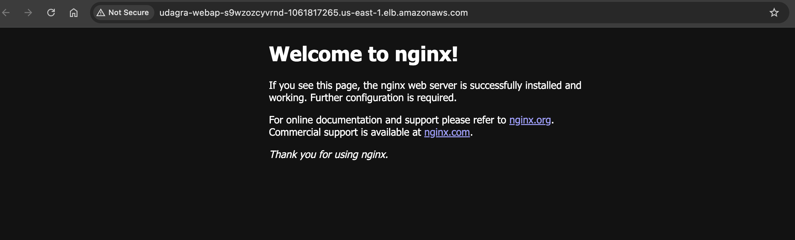

# CD12352 - Infrastructure as Code Project Solution
# Author: Leonce Bali

## Infrastructure
Find the infrastructure in resources folder
You will find it in different format 
- udagram.drawio the original version
- udagram.png the image 
- udagram.svg

### Infrastructure Result

## Instructions
### For Network 
Find the template and the param files in infra folder under respectively these name 
- [network.yml](infra/network.yml)
- [network-parameters.json](infra/network-parameters.json)

### For Udagram
Find the template and the param files in infra folder under respectively these name 
- [udagram.yml](infra/udagram.yml)
- [udagram-parameters.json](infra/udagram-parameters.json)

## Run script to create and update stack
Find script files on the project root under these names
- [create.sh](create.sh) for creation
- [update.sh](update.sh) for update

### How to run it 
#### Network stack creation

#### Network Result

#### Udagram stack creation

#### Udagram Result

#### Udagram url output
